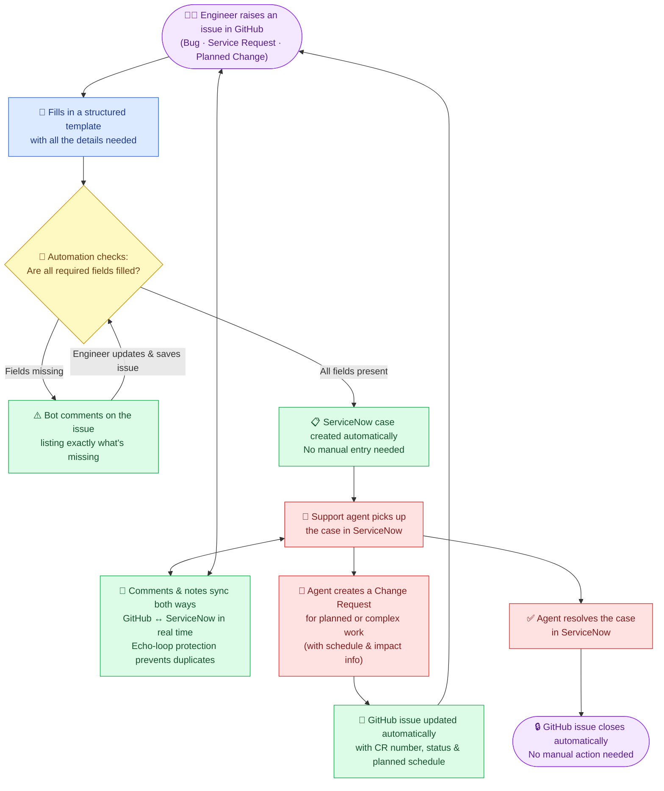

# System Overview Diagram

## What This System Does

This automation bridges **GitHub** (where engineers work) and **ServiceNow** (where the support team works). Instead of someone manually copying information between the two systems, everything syncs automatically — creating cases, updating statuses, syncing comments, and even closing tickets — without anyone having to touch both platforms.

---

## High-Level Flow



---

## Key Points to Know

| What happens | How it works |
|---|---|
| **3 issue types supported** | Bug/Incident, Service Request, Planned Change — each with its own required fields |
| **Validation gate** | If anything is missing, the bot tells you exactly what to fix before a case is created |
| **Automatic case creation** | Once valid, a ServiceNow case appears in the queue with all details pre-filled |
| **Bidirectional comments** | Anything you write in GitHub appears in ServiceNow, and vice versa |
| **Change Request tracking** | When a Change Request is raised in ServiceNow, GitHub is notified with the CR number and schedule |
| **Auto-close** | When the support agent closes the ServiceNow case, the GitHub issue closes itself |

---

## The Two Worlds

```
┌────────────────────────────────┐      ┌──────────────────────────────────┐
│         GITHUB SIDE            │      │        SERVICENOW SIDE           │
│                                │      │                                  │
│  Engineers raise & track       │◄────►│  Support agents triage & resolve │
│  issues using templates        │      │  cases in their normal workflow  │
│                                │      │                                  │
│  • Bug Reports                 │      │  • Case queue                    │
│  • Service Requests            │      │  • Change Requests               │
│  • Planned Changes             │      │  • Work notes & comments         │
│                                │      │  • Case closure                  │
└────────────────────────────────┘      └──────────────────────────────────┘
                         ▲                       ▲
                         └──────────┬────────────┘
                                    │
                         ⚙️ GitHub Actions Automation
                         (runs silently in the background)
```
