# GitHub ↔ ServiceNow Integration

A fully automated bridge between GitHub Issues and ServiceNow Customer Service Cases. Engineers raise Service Requests (SRs) directly in GitHub — validation, case creation, Change Request tracking, and comment synchronisation all happen automatically without anyone touching ServiceNow manually.

---

## Table of Contents

- [High-Level Idea](#high-level-idea)
- [System Architecture](#system-architecture)
- [How It Works — End-to-End](#how-it-works--end-to-end)
  - [Phase 1 — Raising a Service Request](#phase-1--raising-a-service-request)
  - [Phase 2 — Validation](#phase-2--validation)
  - [Phase 3 — Case Creation](#phase-3--case-creation)
  - [Phase 4 — Case Updates](#phase-4--case-updates)
  - [Phase 5 — Change Request Tracking](#phase-5--change-request-tracking)
  - [Phase 6 — Case Closure](#phase-6--case-closure)
  - [Phase 7 — Comment Synchronisation](#phase-7--comment-synchronisation)
- [Workflow Reference](#workflow-reference)
- [Issue Templates](#issue-templates)
- [Labels](#labels)
- [Configuration](#configuration)
- [GitHub Secrets](#github-secrets)
- [User Guide](#user-guide)
- [Bot Comments Reference](#bot-comments-reference)
- [Troubleshooting](#troubleshooting)

---

## High-Level Idea

Before this integration, engineers had to maintain two parallel records: a GitHub issue for team visibility and a ServiceNow case for ITSM tracking. The two systems drifted apart constantly — comments were lost, CR states were missed, and updates had to be duplicated by hand.

This integration eliminates that duplication. GitHub becomes the single interface for engineers. ServiceNow remains the authoritative ITSM record. Automation keeps both in sync.

```
Engineers work entirely in GitHub.
ServiceNow agents work entirely in ServiceNow.
Nothing falls through the gap.
```

**What the automation handles:**

| Trigger | Automated action |
|---------|-----------------|
| GitHub issue created from an SR template | Validates fields, creates a ServiceNow Case |
| Issue edited before any CR exists | PATCHes the ServiceNow Case with updated values |
| ServiceNow creates a Change Request | Posts a CR notification comment on the GitHub issue |
| CR changes state | Posts a state-change comment on the GitHub issue |
| Engineer comments on the GitHub issue | Copies the comment to the ServiceNow case |
| ServiceNow agent posts a case comment | Posts it as a comment on the GitHub issue |

---

## System Architecture

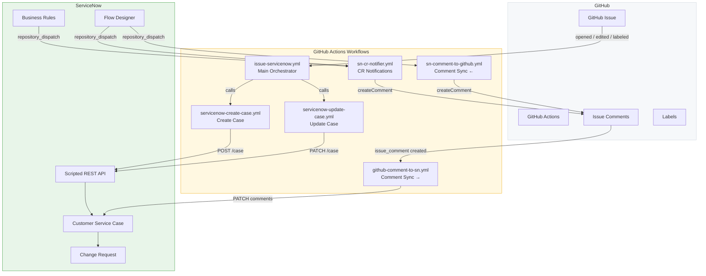

---

## How It Works — End-to-End

### Phase 1 — Raising a Service Request

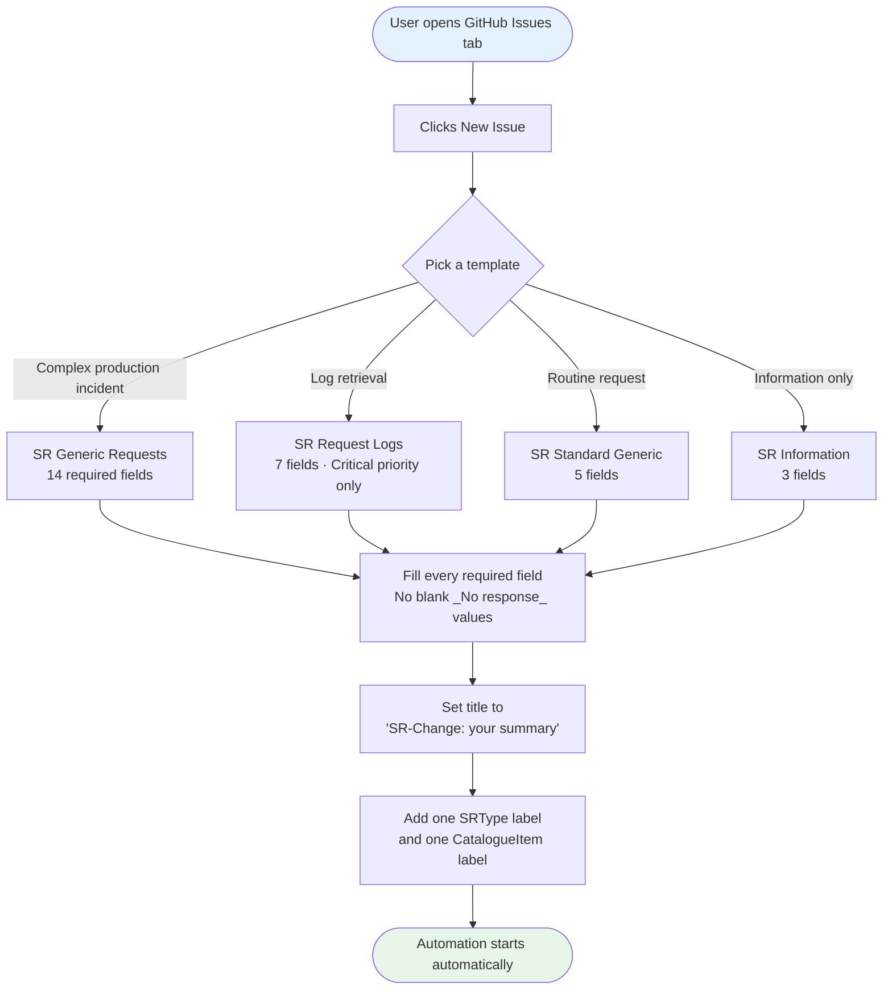

> **Why two labels?** `SRType/*` identifies the ITSM change type (Normal / Standard / Emergency). `CatalogueItem/*` tells the validator which field ruleset to apply. Both must be present before automation runs.

---

### Phase 2 — Validation

The main orchestrator [`issue-servicenow.yml`](.github/workflows/issue-servicenow.yml) runs on every `issues: [opened, edited, labeled]` event. A concurrency group (`sn-pipeline-<issue_number>`) prevents races when multiple events fire in quick succession.

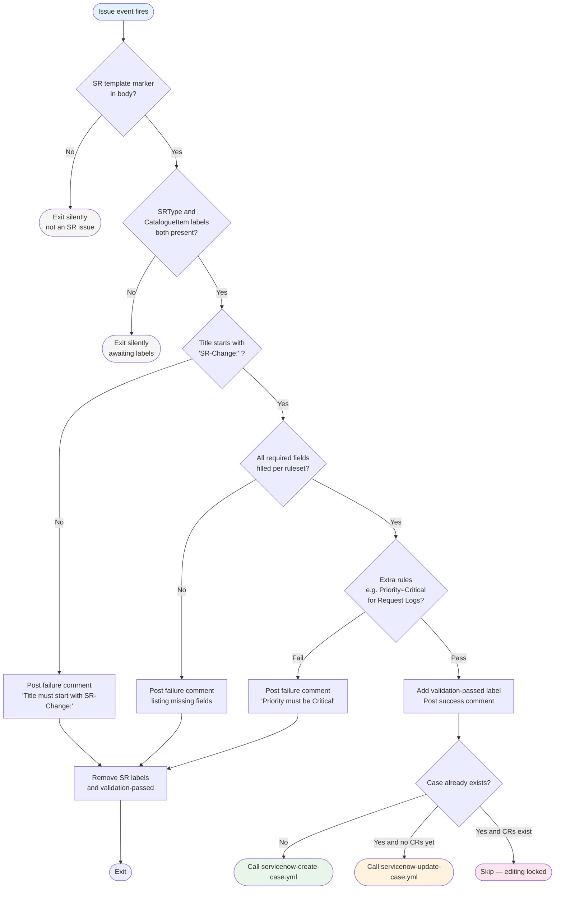

**Validation rules by catalogue item:**

| CatalogueItem | Required fields | Extra rule |
|---------------|----------------|------------|
| Generic Requests | Short Description, Description, Priority, Impact, Impact Description (Overall), Impact Description (Customer), Environment Details, Affected Component, Affected Services, Service Outage/Downtime, Is a maintenance window required, Implementation Plan, Test Plan, Monitoring Checks | — |
| Request Logs | Short Description, Description, Priority, Impact, Impact Description, Customer Project, Environment Details | Priority must be `Critical` |
| Standard Generic | Short Description, Description, Priority, Impact, Environment Details | — |
| Information | Request Description, Impact, Customer Project | — |

A field is blank if its value is `_No response_` (the GitHub template default) or empty.

---

### Phase 3 — Case Creation

[`servicenow-create-case.yml`](.github/workflows/servicenow-create-case.yml) is a reusable workflow called by the orchestrator after successful validation.

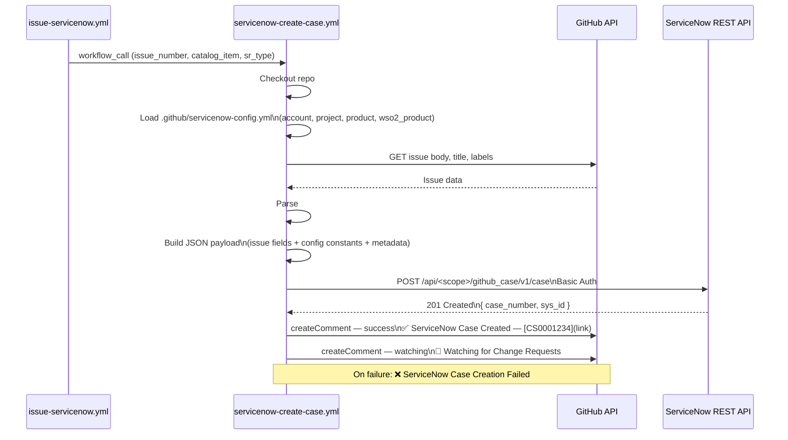

**Payload built:** Every `### Section Name` in the issue body is extracted and mapped to its ServiceNow field name (e.g. `Short Description` → `u_short_description`). Config constants (`account`, `project`, `product`) are merged in. Issue metadata (number, URL, author, labels) is appended.

---

### Phase 4 — Case Updates

When an issue is edited **after** case creation **and before any CR has been created**, [`servicenow-update-case.yml`](.github/workflows/servicenow-update-case.yml) is called instead.

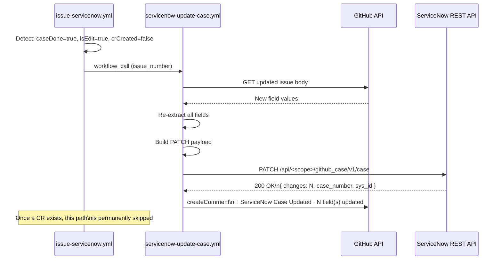

> **Edit lock:** Once a Change Request is detected in the issue comments, editing is permanently disabled for that issue. This prevents the GitHub issue from overwriting SN state after work has begun.

---

### Phase 5 — Change Request Tracking

ServiceNow Business Rules fire `repository_dispatch` events to GitHub. [`sn-cr-notifier.yml`](.github/workflows/sn-cr-notifier.yml) handles three action types.

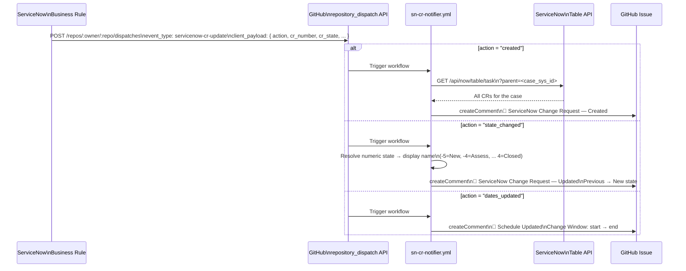

**CR State Map:**

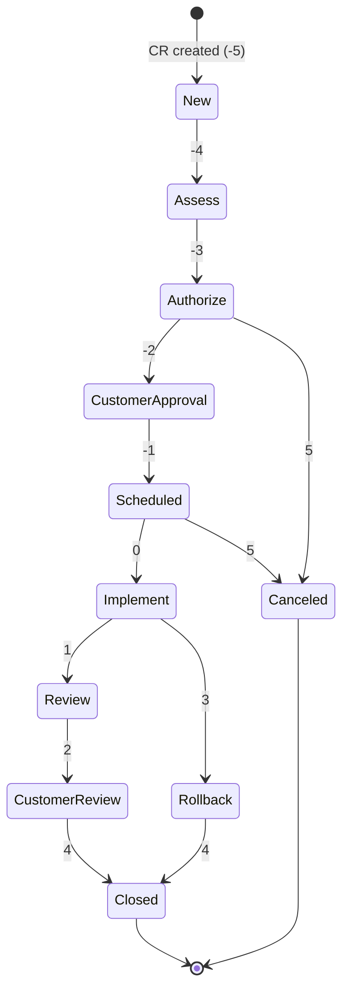

---

### Phase 6 — Case Updates (Closed & Assigned)

A single Flow Designer flow handles both case closure and assignment. It sends a `servicenow-case-update` `repository_dispatch` event with an `action` field. [`sn-case-updates.yml`](.github/workflows/sn-case-updates.yml) branches on that action.

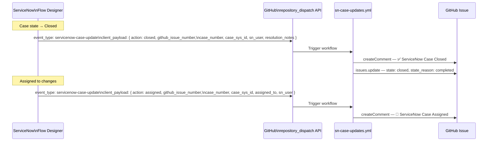

**Payload sent by ServiceNow:**

| Key | Required | Value |
|-----|----------|-------|
| `action` | Yes | `"closed"` or `"assigned"` |
| `github_issue_number` | Yes | GitHub issue number |
| `case_number` | Yes | ServiceNow case number e.g. `CS0001234` |
| `case_sys_id` | Yes | SN record sys_id (used to build the clickable link) |
| `sn_user` | No | Display name of the agent who made the change |
| `resolution_notes` | No | Closure summary (`closed` action only) |
| `assigned_to` | No | Display name of the person assigned (`assigned` action only) |

> **ServiceNow side:** See [GUIDE/ServiceNow/sn-case-updates.md](GUIDE/ServiceNow/sn-case-updates.md) for the single Flow Designer flow that handles both triggers.

---

### Phase 7 — Comment Synchronisation

Both directions of comment sync operate independently.

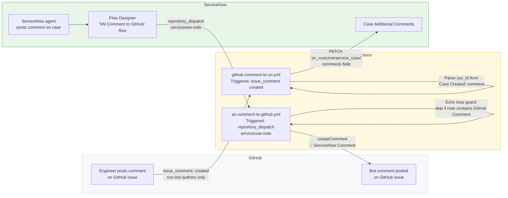

> **Echo loop prevention:** `sn-comment-to-github.yml` checks whether the incoming note contains `(GitHub Comment)` — the tag injected by `github-comment-to-sn.yml`. If it does, it skips posting, preventing an infinite reflection loop.

---

## Workflow Reference

| Workflow | Trigger | Purpose |
|----------|---------|---------|
| [`issue-servicenow.yml`](.github/workflows/issue-servicenow.yml) | `issues: [opened, edited, labeled]` | Main orchestrator — validates and routes |
| [`servicenow-create-case.yml`](.github/workflows/servicenow-create-case.yml) | `workflow_call` | Builds payload and POSTs to ServiceNow |
| [`servicenow-update-case.yml`](.github/workflows/servicenow-update-case.yml) | `workflow_call` | PATCHes the case on issue edit |
| [`sn-cr-notifier.yml`](.github/workflows/sn-cr-notifier.yml) | `repository_dispatch: servicenow-cr-update` | Posts CR create / state-change / schedule comments |
| [`github-comment-to-sn.yml`](.github/workflows/github-comment-to-sn.yml) | `issue_comment: created` | Copies engineer comments to SN case |
| [`sn-comment-to-github.yml`](.github/workflows/sn-comment-to-github.yml) | `repository_dispatch: servicenow-note` | Posts SN agent comments on the issue |
| [`sn-case-updates.yml`](.github/workflows/sn-case-updates.yml) | `repository_dispatch: servicenow-case-update` | Posts assignment comments and closes the issue on case close |
| [`servicenow-inbound.yml`](.github/workflows/servicenow-inbound.yml) | `repository_dispatch: validation-passed` | Thin dispatcher for external/manual triggers |

### Concurrency

Both create and update workflows share the concurrency group `servicenow-issue-<issue_number>` with `cancel-in-progress: false`. This queues — never drops — concurrent runs for the same issue, preventing duplicate cases if a user applies both labels simultaneously.

---

## Issue Templates

Four templates are available under [`.github/ISSUE_TEMPLATE/`](.github/ISSUE_TEMPLATE/). Blank issue creation is disabled via [`config.yml`](.github/ISSUE_TEMPLATE/config.yml).

| Template | When to use | Required fields |
|----------|-------------|----------------|
| [SR Generic](.github/ISSUE_TEMPLATE/sr-generic.md) | Production incidents, complex changes with implementation and test plans | 14 fields |
| [SR Request Logs](.github/ISSUE_TEMPLATE/sr-request-logs.md) | Log extraction requests — Priority must be Critical | 7 fields |
| [SR Standard Generic](.github/ISSUE_TEMPLATE/sr-standard-generic.md) | Routine requests that don't need full plans | 5 fields |
| [SR Information](.github/ISSUE_TEMPLATE/sr-information.md) | Information-only requests; no change will be made | 3 fields |

Every template pre-fills the title as `[SR-Change]: ` and includes a hidden `### Template Marker` section that the orchestrator uses to detect SR issues.

---

## Labels

Labels are defined in [`.github/labels.yml`](.github/labels.yml) and must exist in the repository before any workflow runs.

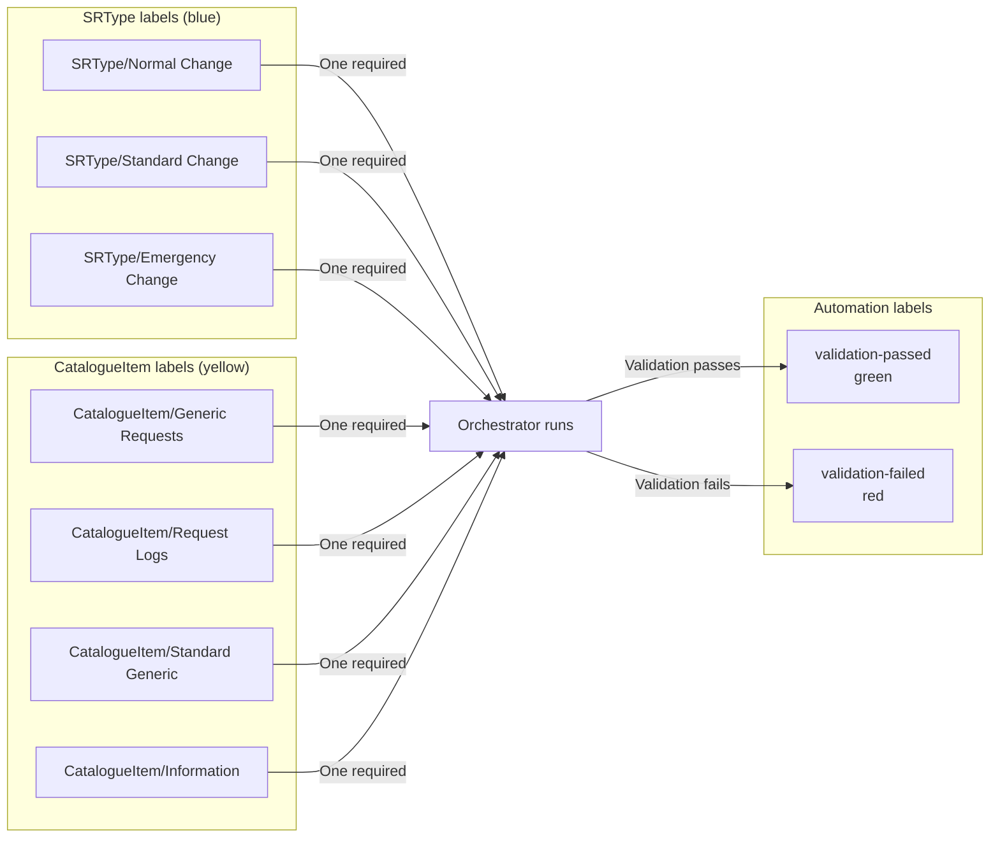

**Label application:**
- `SRType/*` — set by whoever processes the SR (identifies the ITSM change type)
- `CatalogueItem/*` — set by the requester to select the SR form type
- `validation-passed` / `validation-failed` — set automatically by workflows

---

## Configuration

[`.github/servicenow-config.yml`](.github/servicenow-config.yml) holds ServiceNow constants applied to every case. Edit once, commit — no secrets or repository variables needed.

```yaml
case:
  category: "Issue"                     # ServiceNow category display value
  account: "Your Account Name"          # Must exactly match the SN record display name
  announcement_type: "General"          # Exact dropdown value from SN

project:
  name: "Your Project Name"             # Project reference — exact display name
  product: "Your Product Name"          # Product reference — exact display name
  wso2_product: "Your WSO2 Product"     # WSO2 Product reference — exact display name
```

> **Name matching is exact.** For reference fields (`account`, `project`, `product`, `wso2_product`), a mismatch causes ServiceNow to silently leave the field blank — no error is returned. Copy the values character-for-character from the ServiceNow record.

---

## GitHub Secrets

Four secrets must be set in **Repository Settings → Secrets and variables → Actions** before any workflow can run.

| Secret | Value |
|--------|-------|
| `SERVICENOW_URL` | Full Scripted REST endpoint: `https://<instance>.service-now.com/api/<scope>/github_case/v1/case` |
| `SERVICENOW_UI_URL` | Base instance URL: `https://<instance>.service-now.com` — used to build clickable links |
| `SERVICENOW_USERNAME` | ServiceNow user with REST API access |
| `SERVICENOW_PASSWORD` | Password for the above user |

---

## User Guide

### Step 1 — Create a new issue

Go to the **Issues** tab and click **New issue**. Select the template that matches your request. Do not use blank issues (disabled).

### Step 2 — Fill in every required field

Replace every `_No response_` placeholder with real content. Leave no required field empty.

**Accepted priority values:** `Critical` · `High` · `Moderate` · `Low`  
**Accepted impact values:** `High` · `Medium` · `Low`

### Step 3 — Set the issue title

```
[SR-Change]: <short summary of your request>
```

Example: `[SR-Change]: Production API Gateway returning 502 errors`

The validation fails if the title does not start with `[SR-Change]:`.

### Step 4 — Add labels

Add exactly:
- One `SRType/*` label (`SRType/Normal Change`, `SRType/Standard Change`, or `SRType/Emergency Change`)
- One `CatalogueItem/*` label matching the template you used

Automation starts within seconds of both labels being present.

### Step 5 — Watch the comments

Every automated step posts a comment. No ServiceNow login needed to track progress.

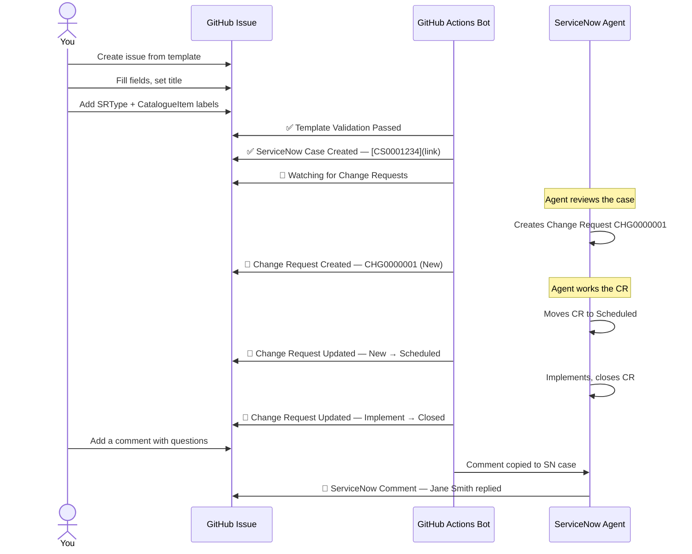

---

## Bot Comments Reference

| Comment | Workflow | When posted |
|---------|----------|------------|
| `✅ Template Validation Passed` | `issue-servicenow.yml` | All fields and labels valid |
| `❌ Template Validation Failed` | `issue-servicenow.yml` | Missing fields, bad title, or wrong priority |
| `✅ ServiceNow Case Created — [CSxxxxxxx]` | `servicenow-create-case.yml` | Case created in ServiceNow |
| `❌ ServiceNow Case Creation Failed` | `servicenow-create-case.yml` | POST to ServiceNow failed |
| `👀 Watching for Change Requests` | `issue-servicenow.yml` (cr-watch job) | Alongside case creation success |
| `🔄 ServiceNow Case Updated` | `servicenow-update-case.yml` | Issue edited, PATCH succeeded |
| `❌ ServiceNow Case Update Failed` | `servicenow-update-case.yml` | PATCH to ServiceNow failed |
| `💬 Change Request — Created #CHGxxxxxxx` | `sn-cr-notifier.yml` | SN Business Rule fires on CR insert |
| `💬 Change Request — Updated #CHGxxxxxxx` | `sn-cr-notifier.yml` | SN Business Rule fires on CR state change |
| `💬 Change Request — Schedule Updated` | `sn-cr-notifier.yml` | SN Business Rule fires on CR date change |
| `✅ ServiceNow Case Closed — [CSxxxxxxx]` | `sn-case-updates.yml` | SN case closed — GitHub issue is also closed |
| `👤 ServiceNow Case Assigned — [CSxxxxxxx]` | `sn-case-updates.yml` | SN case assigned to a team member |
| `💬 ServiceNow Comment — Case CSxxxxxxx` | `sn-comment-to-github.yml` | SN Flow Designer posts a case comment |
| `📋 ServiceNow Work Note` | `sn-comment-to-github.yml` | SN Flow Designer posts a work note |

---

## Troubleshooting

**Validation failed — what do I do?**

Read the failure comment. It names the specific field or rule that failed. Fix the issue body and re-add the `SRType/*` and `CatalogueItem/*` labels to re-trigger validation. The previous failure comment is automatically deleted when you retry.

**I edited the issue but no update comment appeared.**

Check whether a `💬 Change Request — Created` comment already exists on the issue. Once a CR exists, issue-edit updates are permanently disabled to prevent overwriting in-progress work. Post a comment instead — it will sync to the case.

**"ServiceNow Case Creation Failed" appeared.**

This is a configuration problem (wrong credentials, endpoint URL, or `servicenow-config.yml` values not matching SN display names). Check the workflow logs linked in the comment. Do not close and reopen the issue — fix the configuration and re-trigger by removing and re-adding the labels.

**The case was created but SN fields are blank.**

Reference fields (`account`, `project`, `product`, `wso2_product`) in `servicenow-config.yml` must exactly match ServiceNow display names. A mismatch causes silent blank — no error is returned by ServiceNow. Copy the values character-for-character from the SN record.

**CR state changes are not appearing on the issue.**

The ServiceNow Business Rules must be configured to send `repository_dispatch` events to GitHub. Verify the `github.dispatch.config` system property in ServiceNow contains the correct PAT, owner, and repo. See `GUIDE/ServiceNow/sn-cr-notifier.md` for setup instructions.

**Comments are not syncing to ServiceNow.**

`github-comment-to-sn.yml` only runs when a `✅ ServiceNow Case Created` comment exists on the issue (it reads the `sys_id` from the URL in that comment). If case creation failed, comment sync will not work.

**Do I need a ServiceNow account?**

No. All case and CR information is visible on the GitHub issue via bot comments. The comments include direct links to ServiceNow records if you need to view them in detail (ServiceNow credentials required to log in there).

---

## Repository File Map

```
.github/
├── workflows/
│   ├── issue-servicenow.yml          Main orchestrator
│   ├── servicenow-create-case.yml    Reusable: POST case to SN
│   ├── servicenow-update-case.yml    Reusable: PATCH case on issue edit
│   ├── sn-cr-notifier.yml            Inbound: CR create/state/schedule events
│   ├── github-comment-to-sn.yml      Outbound: engineer comments → SN
│   ├── sn-case-updates.yml           Inbound: SN case closed / assigned → GitHub
│   ├── sn-comment-to-github.yml      Inbound: SN agent comments → GitHub
│   └── servicenow-inbound.yml        Thin dispatcher for manual triggers
├── ISSUE_TEMPLATE/
│   ├── config.yml                    Disables blank issues
│   ├── sr-generic.md                 Full 14-field SR form
│   ├── sr-request-logs.md            Log request form (Critical only)
│   ├── sr-standard-generic.md        Simplified 5-field form
│   └── sr-information.md             Minimal 3-field information form
├── labels.yml                        Label definitions
└── servicenow-config.yml             ServiceNow constants (account, project, product)
```
