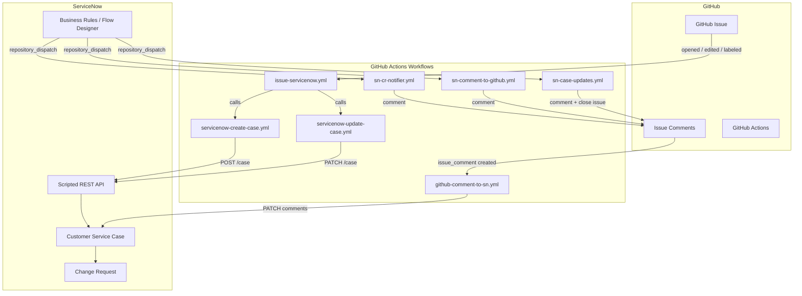
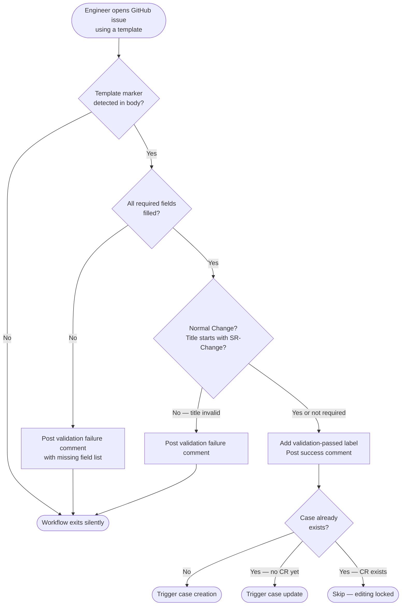
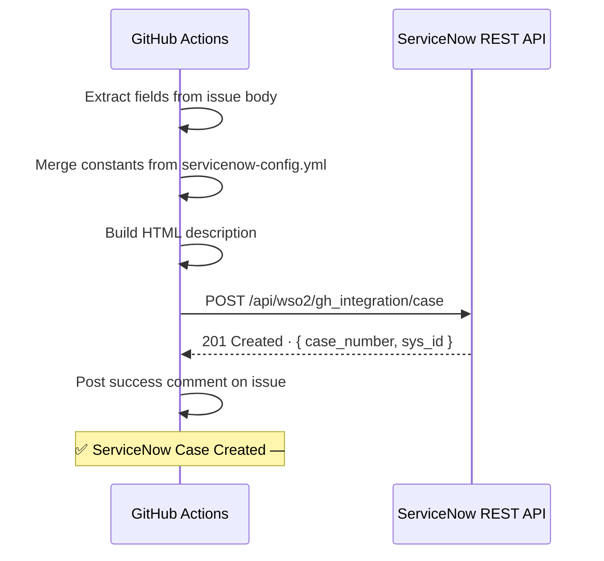
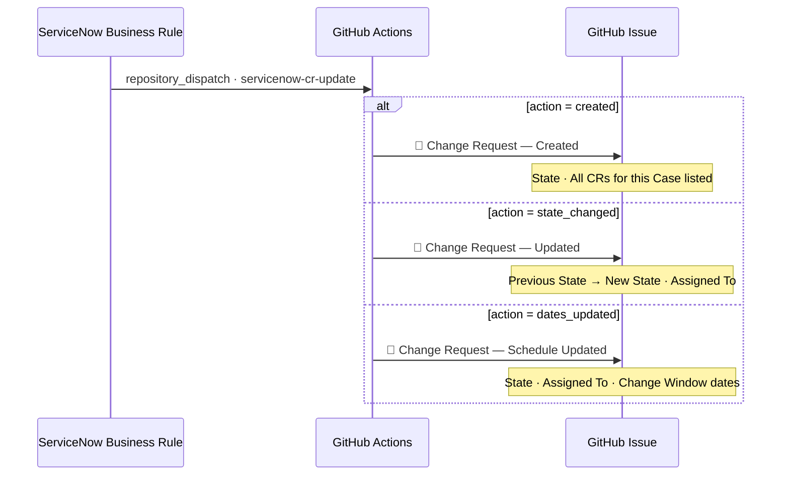
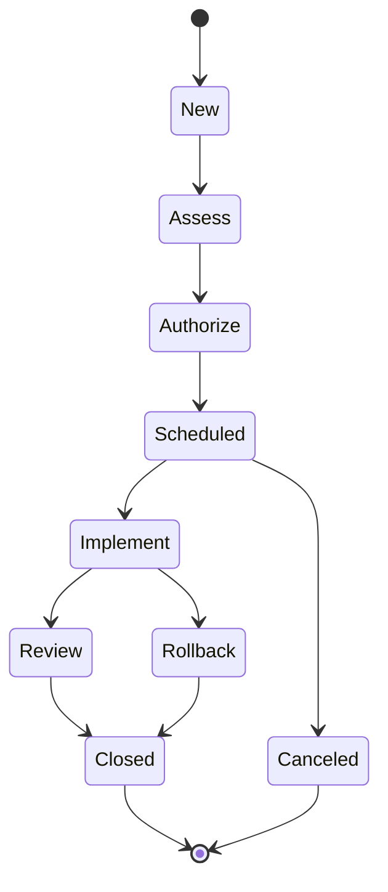
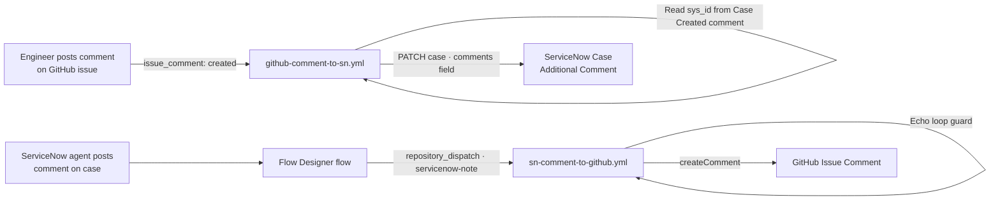

# GitHub ↔ ServiceNow Issue Automation

## Overview

This report documents the automated integration between GitHub Issues and ServiceNow Customer Service Cases implemented for the WSO2 API Manager project. The integration eliminates manual duplication between GitHub (used by engineers) and ServiceNow (used by the ITSM team) by automating case creation, field synchronisation, Change Request tracking, and comment relay in both directions.

Engineers raise requests entirely in GitHub. ServiceNow agents work entirely in ServiceNow. Automation keeps both systems in sync without human intervention.

---

## System Architecture

---

## Issue Templates

Three GitHub Issue templates are configured. Labels are applied automatically on submission.

| Template | Purpose | Auto Labels |
|---|---|---|
| Bug Report / Incident | Report a bug or system incident | `Type/Incident`, `bug` |
| Service Request-Generic | General service or information request | `Type/ServiceRequest` |
| Normal Change Generic | Planned change with full implementation details | `SRType/Normal Change`, `CatalogueItem/Generic Requests` |

Blank issue creation is disabled — all issues must use one of the three templates.

---

## End-to-End Flow

### Stage 1 — Issue Submission and Validation

**Validation rules by template:**

| Template | Required Fields | Title Rule |
|---|---|---|
| Bug Report / Incident | Issue Summary, Detailed Description, Severity, Affected Environments | None |
| Service Request-Generic | Request Details, Description, Priority, Environment Details | None |
| Normal Change Generic | 14 fields including implementation plan, test plan, outage details | Must start with `[SR-Change]:` |

---

### Stage 2 — Case Creation

The workflow extracts all `### Section` fields from the issue body and maps them to ServiceNow field names. Constants (account, project, product) are merged from `.github/servicenow-config.yml`. The API is idempotent — submitting the same issue number twice returns the existing case without creating a duplicate.

**Fields sent to ServiceNow by template:**

| ServiceNow Field | Bug / Incident | SR Generic | Normal Change |
|---|---|---|---|
| `short_description` | Issue title | Issue title | Short Description field |
| `priority` | Severity | Priority | Priority |
| `u_request_details` | Issue Summary | Request Details | — |
| `description` | Detailed Description | Description | Description |
| `u_project_environment` | Affected Environments | Environment Details | Environment Details |
| `impact` | — | — | Impact |
| `u_impact_description_overall` | — | — | Impact Description (Overall) |
| `u_impact_description_customer` | — | — | Impact Description (Customer) |
| `u_affected_component` | — | — | Affected Component |
| `u_affected_services` | — | — | Affected Services |
| `u_service_outage` | — | — | Service Outage/Downtime |
| `u_implementation_plan` | — | — | Implementation Plan |
| `u_test_plan` | — | — | Test Plan |
| `catalog_item` | Incident Management | General Requests | Generic Requests |
| `case_type` | Incident | Service Request | Service Request |

---

### Stage 3 — Case Updates on Issue Edit

If the engineer edits the issue body **before any Change Request has been created**, the workflow sends a PATCH to ServiceNow with the updated field values. A work note is added to the case listing each changed field with old and new values.

Once a Change Request exists, issue-edit updates are permanently disabled to prevent overwriting in-progress work. Engineers can still post comments, which continue to sync.

---

### Stage 4 — Change Request Tracking

ServiceNow Business Rules send `repository_dispatch` events to GitHub whenever a Change Request is created, its state changes, or its schedule is updated.

**Change Request state lifecycle:**

---

### Stage 5 — Comment Synchronisation

An echo-loop guard prevents reflection: if an incoming ServiceNow note contains the `(GitHub Comment)` tag injected by the outbound sync, it is skipped.

---

### Stage 6 — Case Closure and Assignment

A ServiceNow Flow Designer flow fires on case state changes and sends `repository_dispatch` events back to GitHub.

| ServiceNow action | GitHub result |
|---|---|
| Case assigned to agent | `👤 ServiceNow Case Assigned — #CSxxxxxxx [timestamp]` comment posted |
| Case closed | `✅ ServiceNow Case Closed — #CSxxxxxxx [timestamp]` comment posted · GitHub issue closed automatically |

---

## Workflow Summary

| Workflow | Trigger | Responsibility |
|---|---|---|
| `issue-servicenow.yml` | `issues: opened / edited / labeled` | Orchestrator — validates and routes |
| `servicenow-create-case.yml` | `workflow_call` | Builds payload, POSTs to ServiceNow |
| `servicenow-update-case.yml` | `workflow_call` | PATCHes case on issue edit |
| `sn-cr-notifier.yml` | `repository_dispatch: servicenow-cr-update` | CR create / state / schedule comments |
| `github-comment-to-sn.yml` | `issue_comment: created` | Copies GitHub comments to SN case |
| `sn-comment-to-github.yml` | `repository_dispatch: servicenow-note` | Posts SN agent comments on issue |
| `sn-case-updates.yml` | `repository_dispatch: servicenow-case-update` | Closure and assignment notifications |
| `sync-labels.yml` | Push to `main` / `workflow_dispatch` | Syncs `labels.yml` to the repository |

---

## Configuration

### GitHub Secrets

| Secret | Purpose |
|---|---|
| `SERVICENOW_URL` | Scripted REST API endpoint for case create/update |
| `SERVICENOW_UI_URL` | Base ServiceNow URL for building record links |
| `SERVICENOW_USERNAME` | API user credentials |
| `SERVICENOW_PASSWORD` | API user credentials |

### ServiceNow Constants — `.github/servicenow-config.yml`

Applied to every case regardless of template. Holds the account, project, product, and category values that are constant across all requests from this repository.

### ServiceNow Setup

| Component | Purpose |
|---|---|
| Custom columns `u_github_issue_number`, `u_github_issue_url` on `sn_customerservice_case` | Links SN case back to the GitHub issue |
| System property `github.dispatch.config` | GitHub PAT, owner, and repo for outbound events |
| Scripted REST API `POST /api/wso2/gh_integration/case` | Receives case creation payload from GitHub |
| Scripted REST API `PATCH /api/wso2/gh_integration/case` | Receives field update payload from GitHub |
| Business Rules on `change_request` | Fire outbound CR events to GitHub |
| Flow Designer flows on `sn_customerservice_case` | Fire outbound case events and comment sync to GitHub |

---

## Key Design Decisions

| Decision | Reason |
|---|---|
| Labels auto-applied by templates | Reduces user steps; eliminates label errors |
| Idempotent POST API | Prevents duplicate cases if the workflow retries |
| Edit lock after CR creation | Prevents GitHub edits from overwriting in-progress SN state |
| Timestamp in comment header `[YYYY-MM-DD HH:MM:SS IST]` | Consistent with case creation format; removes redundant body line |
| Echo-loop guard on comment sync | Prevents infinite reflection between GitHub and ServiceNow |
| `servicenow-config.yml` for constants | Constants committed to the repo — no extra secrets or variables needed |
